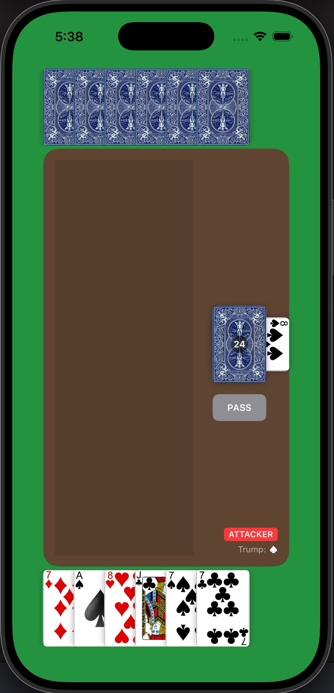
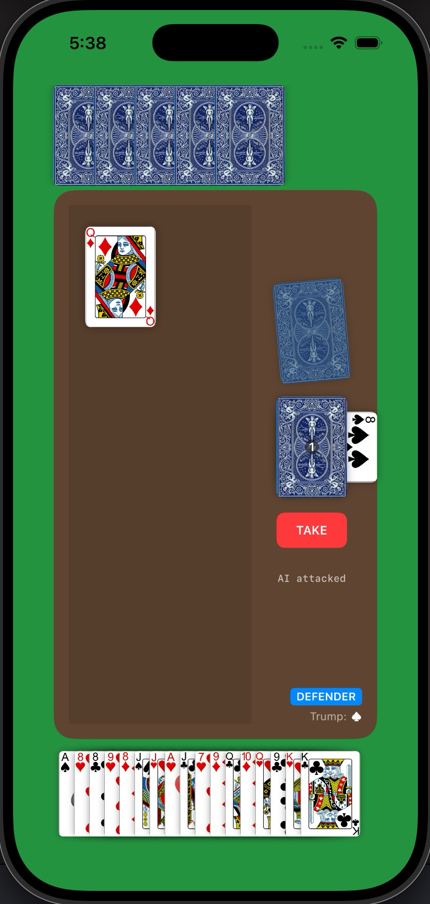
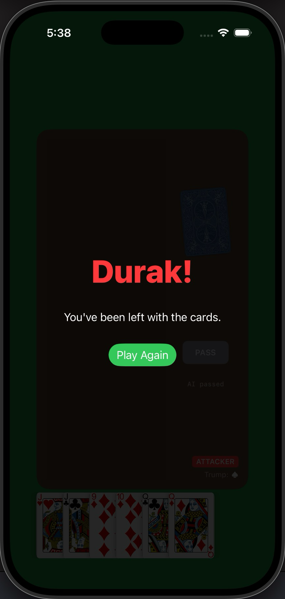

# 🃏 Durak — SwiftUI Card Game

## 🌟 Highlights

- Fully playable single-player **Durak** (a traditional Eastern European / Slovak card game) built from scratch — no starter or skeleton code
- Custom AI opponent that attacks, defends, and manages trump cards using rank/suit-based heuristics
- **Adaptive UI**: hands dynamically "crunch" (overlap and scale down) as they grow so gameplay stays comfortable on any screen size
- MVVM architecture — all game rules and state transitions live in a testable `ObservableObject` view model, fully decoupled from the SwiftUI views
- Custom deck logic layered on top of the `DeckOfPlayingCards` package to produce a proper 36-card Durak deck (6 through Ace)

## ℹ️ Overview

Durak ("fool" in Russian/Slovak) is a card game I grew up playing with my parents. For my Mobile App Development course, I decided to rebuild it from the ground up as a native iOS app rather than start from a course template, both as a personal challenge and as a way to preserve a game that means a lot to my family.

The app lets a single player face off against an AI opponent, handling the full Durak rule set: dealing, trump determination, attacking, defending, taking, passing, and win/loss/draw conditions. All game logic (including AI decision-making) is implemented in Swift using an MVVM pattern, with SwiftUI driving a responsive table-style layout that adapts as each player's hand grows or shrinks.

### ✍️ Author

Built by **Kirill Zhurbytskyy**. Find more of my work on [GitHub](https://github.com/Kirillzy).

## 🚀 Usage

Launch the app and you're dropped straight into a game:

```
1. Cards are dealt (6 per player) and the trump suit is revealed.
2. Whoever holds the lowest trump card attacks first.
3. Tap a card in your hand to attack or defend.
4. Use PASS (as attacker) or TAKE (as defender) to end your turn.
5. First to empty their hand wins — last one holding cards is the "Durak."
```

#### Table View  |  Dynamic Hand Scaling  | Win-screen



## ⬇️ Installation

**Requirements:** Xcode, iOS Simulator or device. No external dependencies to install manually — the project uses Swift Package Manager for `DeckOfPlayingCards` / `PlayingCard`, which Xcode resolves automatically.

```
1. Clone the repository
2. Open Durak.xcodeproj in Xcode
3. Press Cmd+R to build and run in the simulator
```

## 🎮 How to Play

<details>
<summary>Full rules (click to expand)</summary>

**Setup**
Each player starts with 6 cards. The next card dealt becomes the **Trump Card** — its suit becomes the Trump Suit, which beats every other suit regardless of rank. The player holding the lowest-ranking trump card goes first as Attacker.

**Attacking**
The Attacker plays cards into the center, trying to empty their hand. The opening card can be anything; every follow-up card must match the rank of a card already on the table (e.g., if a 6 and an 8 are down, only more 6s or 8s can be added). When the Attacker is done, they Pass — the table clears to the discard pile and roles swap.

**Defending**
The Defender must beat every attacking card: a higher card of the same suit, or any trump if the attack wasn't a trump (a trump attack needs a higher trump to beat it). If the Defender can't (or won't) beat a card, they Take — all table cards go into their hand, and they defend again next round instead of attacking.

**Drawing & Endgame**
After each round, players draw back up to 6 cards — Attacker first, then Defender. Once the draw pile runs out, the game enters its endgame: first player to empty their hand wins, the other is left holding cards ("the Durak"). If both empty their hands on the same turn, it's a draw.

</details>

## 🛠️ Under the Hood

| Piece | What it does |
|---|---|
| `DurakDeck.swift` | Builds a 36-card Durak deck from the standard 52-card deck (strips 2–5) |
| `SimulateGame.swift` | `GameViewModel` — all game state and rules: turn logic, attack/defend validation, AI behavior, win detection |
| `Game.swift` | Main SwiftUI view — table layout, dynamic hand spacing/scaling, status badges |
| `SubCardViews.swift` | Reusable card, card-back, and overlay views |
## 🧠 Design Notes

A few decisions and tradeoffs worth calling out, mostly for my own future reference:

- **Simplified "takes cards" rule for 2-player.** In real Durak with 3+ players, taking cards passes the attack to the _next_ player in turn order. With only one AI opponent, there's no "next player" to hand off to, so the same attacker just goes again after the defender takes. This is called out directly in `defenderTakesTable()` — worth revisiting if I ever add more AI opponents.
- **Endgame detection is deck-driven, not turn-driven.** `checkForWinner()` only fires once `deck.count == 0 && trumpCard == nil` — i.e., once there's nothing left to draw. This matches real Durak (you can't "win" mid-game just because your hand is briefly empty if you're about to draw more cards), but it means the win check has to be called carefully after _every_ hand-emptying event, not just at end of turn.
- **The trump card doubles as the last card in the draw pile.** Rather than tracking it as a separate pile, `trumpCard` is dealt with at reveal time and only gets folded into `refillHand()` once the main deck is exhausted. This keeps the "deck count + trump" display logic simple but means `trumpCard != nil` is silently doing double duty as both "what's the trump suit" and "is there one card left to draw" — a bit overloaded, but avoided a second published property.
- **`isProcessing` as a blunt UI lock.** Rather than fine-grained state machine states (attacking/defending/animating/etc.), I used a single boolean to lock player input while the AI "thinks." Simple and effective for a 2-player game, but it means every AI action path has to remember to flip it back to `false` — a couple of near-misses while debugging turn transitions.
- **AI "thinking" delay is a hardcoded `DispatchQueue.main.asyncAfter(1.5s)`.** Purely for UX — instant AI moves felt jarring and made the opponent feel less "real." Tradeoff: it's a fixed delay rather than tied to any actual computation, so it doesn't scale with move complexity (not that this AI needs it).
- **AI priorities are simple heuristics, not lookahead.** The AI always plays its lowest non-trump card when attacking, and its lowest valid card when defending. This is a naive linear sort (`sorted.first`), not a minimax/lookahead player. It plays "reasonably" but doesn't model whether trading cards now sets up a bad situation later — a good candidate for a v2 if I want more challenging difficulty tiers.
- **Dynamic hand crunching uses fixed breakpoints, not a continuous formula.** `dynamicSpacing(for:)` and `dynamicScale(for:)` step down at hardcoded thresholds (6, 10, 12 cards) rather than interpolating smoothly. Simpler to reason about and tune by eye, at the cost of a slightly visible "jump" right at each threshold.

## 💭 Feedback and Contributing

This started as a solo course project, but I'd love feedback! Feel free to open an issue if you spot a bug or have ideas for improving the AI (e.g., smarter defense prioritization, throw-in logic for multiplayer-style attacks). Pull requests are welcome.
